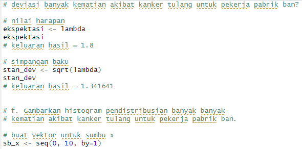
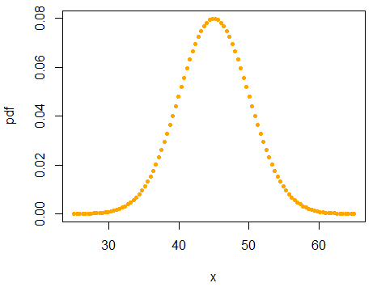

## 1. Probabilitas seorang bayi yang baru lahir berjenis kelamin laki-laki adalah 0,488. Jika kita asumsikan bahwa dalam satu hari di rumah sakit terdapat 10 kelahiran, maka:
### a. Bagaimana pendistribusian banyak bayi laki-laki? Tentukan distribusi dengan parameter yang sesuai.
Untuk soal 1 digunakan distribusi binomial karena terdapat 2 kemungkinan hasil (laki-laki & bukan laki-laki/perempuan). Serta terdapat 10 kelahiran sebagai jumlah percobaan independen dan probabilitas bayi yang lahir laki-laki adalah 0,488. Parameter-parameter yang sesuai adalah sebagai berikut:
- n (jumlah percobaan) = 10
- p (probabilitas keberhasilan) = 0,488
### b-f

### Histogram dan Tabel Nilai

## 2. Misalkan banyak kematian karena kanker tulang untuk seluruh pekerja di pabrik ban dalam 20 tahun ke depan adalah 1,8.
### a. Bagaimana pendistribusian banyak kematian karena kanker tulang? Tentukan distribusi dengan parameter yang sesuai.
Untuk soal 2 digunakan distribusi poisson karena terdapat rentang waktu tertentu. Serta banyaknya kejadian kematian karena kanker tulang dalam 20 tahun ke depan adalah 1,8. Parameter-parameter yang sesuai adalah sebagai berikut:
- t (waktu) = 20
- lambda (rata-rata banyak kejadian dalam t) = 1,8
### b-g

### Histogram dan Tabel Nilai

### h. Jelaskan banyak kematian akibat kanker tulang berdasarkan simulasi Anda. Bandingkan jawaban pada pertanyaan 2d dengan hasil simulasi Anda.
Rata-rata probabilitas kematian dengan jumlah lebih dari 4 yang disimulasikan secara acak sebanyak 100 kali adalah 0,02. Sedangkan jawaban dari pertanyaan 2d adalah 0,03640666. Selisih yang kecil berarti jawaban dari pertanyaan 2d bisa dibilang valid.

## 3. Diketahui nilai x = 3 dan v = 10. Tentukan:
### a. Fungsi probabilitas dari distribusi Chi-Square.
Jawab: f(x) = (1 / (2^(v/2) * Γ(v/2))) * x^(v/2 - 1) * e^(-x/2)
-> f(x) = (1 / (2^(5) * Γ(5))) * x^(4) * e^(-x/2)
-> f(x) = (1 / 768) * x^(4) * e^(-x/2)
### b-c

### Histogram dan Tabel Nilai

## 4. Diketahui data bangkitan acak sebanyak 100 dengan mean = 45 dan sd = 5. Tentukan:
### Jawaban:

### Plot Titik, Histogram, dan Tabel Nilai

## 5. Kerjakanlah menggunakan distribusi T-Student.
### Jawaban:

### Tabel Nilai
